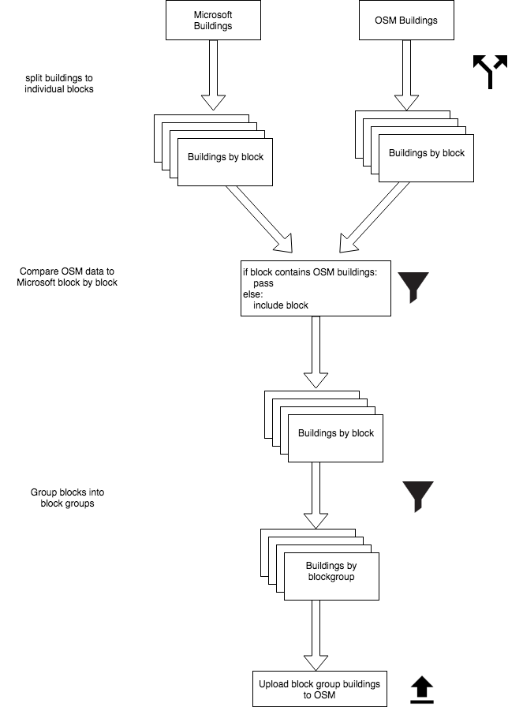

# Albuquerque Building Import

The main repo for outlining data import methods for mass buildings import into OpenStreetMap for Albuquerque.

## Proposed process

### Initial Imports

1. Split Microsoft building data and existing OpenStreetMap building data in to block units

2. If a block already has OpenStreetMap building within it, mark the block and do not include in set.

3. Group blocks with Microsoft building data (those which passed the test above) into Census Blockgroups 

4. Import block groups into OpenStreetMap

### Secondary Imports

1. Import individual blocks which already had some or complete OpenStreetmap coverage

## Maps

[Census Blocks](https://mapabq.github.io/abqbuildings/blocks.html)

[Census Block Groups](https://mapabq.github.io/abqbuildings/blockgroups.html)